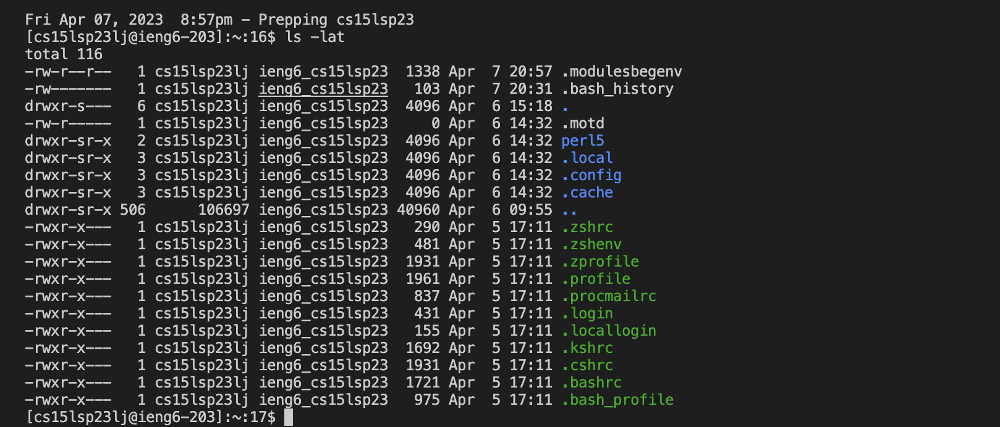

## Lab Report 1 

In this report, I will be showing you the following:

1. How to Install VSCODE
2. Remotely Connect 
3. Trying Out Different Commands

# How to install VSCODE 

First go to the [vscode](https://code.visualstudio.com/Download) website. Next, download the version of vscode specifcally made for your operating system.
After doing so, the download usually appears on the bottom of your screen. Once it is finished downloading, open the file to finish the installation 
process. Next, locate it on your computer and open vscode. If you see a screen as shown below, it means you have successfully downloaded vscode!! 


# Remotely Connecting 

In this section, I'll be showing you how to connect to a remote server on a remote computer. As a Macbook user, I did not need to download git but for 
future reference, if you are operating a Windows device, you'll need to download by going to the [git](https://gitforwindows.org/) download page and 
follow the instructions givven. 

Continuing on, open vscode on your device and open a `ssh` terminal by using the keyboard shortcut (this is assuming you are on macbook) 
command + shift + P and clicking on "Debug: JavaScript Debug Terminal" in order to open the terminal. After opening the terminal, log into the server 
using the following command as well as your account username (for reference, I used my account username but the `lj` in the username will be different:

```
$ ssh cs15lsp23lj@ieng6.ucsd.edu
```
Remember when using this command, you do not need to input the `$`. After doing so, a message in your terminal will appear and will ask whether or not you
want to continue connecting to the server. Type "Yes" and hit enter to continue. The terminal will then ask for your password and input your password. It
is important to note that when you input your password, the terminal will register your actions but will not display your password as you type it. If you
make a mistake, hit enter to restart. (I failed inputting my password multiple times so if you do fail it is okay :)) 

After inputting your password, the following image should appear. 


If you see this on your terminal, congrats! You have successfully logged into `ieng6` and completed connecting your device remotely. Onto the examples! 

# Trying Out Different Commands  

In this section, I'll be showcasing different commands you can test on the remote server. 

Inputting the command `pwd` will print your working directory 

```
[cs15lsp23lj@ieng6-202]:~:9$ pwd
/home/linux/ieng6/cs15lsp23/cs15lsp23lj
``` 

Inputting the command `cd` will allow for you to navigate and change your working directory. Here is an example of me switching the `cs15lsp23/public` 
directory. I used the `pwd` command after to check if I successfully switched into that directory. 


Inputting the command `ls -lat` will list the content of the given directory `lat` as shown in the image below:



That's all! Thank you for reading my report!


