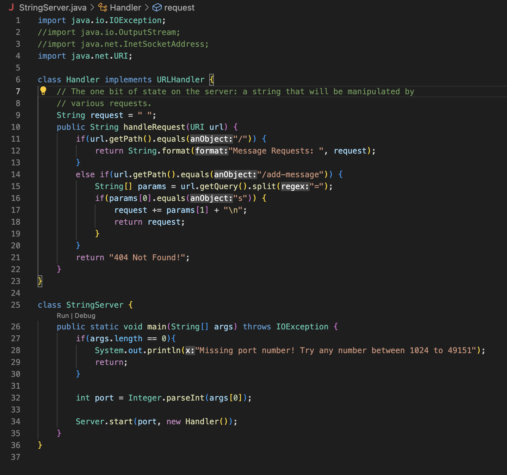
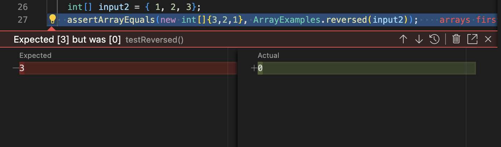

## Lab Report 2

In this report, I will be showcasing the following: 

1. A web server called StringServer
2. A bug from Lab 3
3. Lab discoveries/findings

# StringServer

The following image contains the code for a web server I've coded titled StringServer. This server monitors a single string and handles requests of 
incoming strings and concatenates them to the single string it is keeping track of. 



In order to start the server, type in the following commands (For reference, I'm on a Macbook). 

```
javac StringServer.java
java StringServer 4000
```

After that, a message stating `"Server Started! Visit http://localhost:4000 to visit."` should appear within your terminal. Additionally, you can use any
number other than 4000 that are also in the thousands. The `4000` represents the port and can be interchangable. 

Continuing on, heading on over to the website provided, the first page that appears is a dark blank page with the words `"Message Requests: "`. This string
is here to depict that there are currently no requests. In order to send in a request, in the search bar after `http://localhost:4000`, type in the 
following command to add messages. 

```
/add-message?s=<string>
```
After typing it into the search bar, replace `<string>` with any message request you may have. Here are examples of message requests I've added and the 
website updating the string with each request. 

```
http://localhost:4000/add-message?s=I love kim chaewon
http://localhost:4000/add-message?s=She is my sole will to live
```


The commands both call on the handleRequest method within the code. Since the request I inputted begins with `/add-message`, the first commands
satisfies the condition for the code and concatenates the string "I love kim chaewon" to the empty string `request` at the top of the code and the 
message outputted on the web server is now "I love kim chaewon" The second command after calling handleRequest also satisfies the condition for the code 
as the command begins with `/add-message`. The code will now concatenate the string "She is my sole will to live" to the website. It will be on the second
line and not next to the first string we inputted because of the `"/n` I added on line 17 of my code.

After these commands, the website should now look like this: 


# Lab 3 Bug 

A code containing a bug is the reversed code as shown below. The goal of the code is to return a new array with all the elements in the inputted array
but reversed.

```  
static int[] reversed(int[] arr) {
    int[] newArray = new int[arr.length];
    for(int i = 0; i < arr.length; i += 1) { 
      arr[i] = newArray[arr.length - i - 1]; 
    }
    return arr;
  }
```

This code is currently incorrect but passes this following junit test as this test only checks the reversed of an empty array which is an empty array:
```
  @Test
  public void testReversed() {
    int[] input1 = { };
    assertArrayEquals(new int[]{ }, ArrayExamples.reversed(input1));
  }
 ```
 
This code is currently incorrect but fails the following junit test as it incorrectly reverses the array and gives an actual value of 0 instead of the 
expected value of 3.

```@Test
   public void testReversed2(){
     int[] input2 = {1,2,3}
     assertArrayEquals(new int[]{3,2,1}, ArrayExamples.reversed(input2));
   }
```
Here is the error that is produced: 



Here is the corrected version of the code that correctly reverses the array into an new array. To fix the code, I swapped args[i] with 
newArray[arr.length - i - 1]. This ensures that the now reversed indices as labled by the new array retain the value of the original array. Then I 
returned newArray instead of arr to ensure we are returning the reversed array instead of the original array.

```
  static int[] reversed(int[] arr) {
    int[] newArray = new int[arr.length];
    for(int i = 0; i < arr.length; i += 1) { 
      newArray[arr.length - i - 1] = arr[i];
    }
    return newArray;
  }
 ```


# Lab Discoveries and Findings

In lab 2, I learned how to operate and run a new web server as shown in the first header above. I learned that if one remotely connects to a computer
you cannot use the same port as other people as it would error (if the computer server you are on is the same server. Also, instead of tracking a string 
and message requests, I learned how to monitor and increment a number on a web server and have the number update everytime I incremented the number. 

Thank you for reading my lab report! Hope to see you soon! :D


