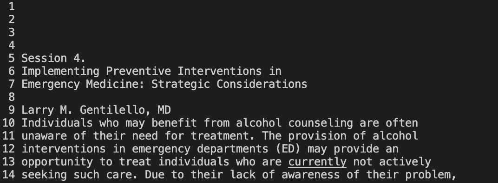
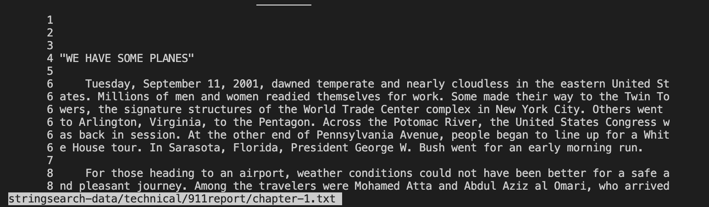

## Lab Report 3

In this lab report, I will be showcasing the following:

1. Command line operations for `less` 

# Command line operations for `less` 

The `less` command without any additional operations usually prints all the lines within the file into the terminal in separated segements. While looking
at the contents of your file through the `less` command, there will be a ':' at the bottom of the terminal signifying that you can continue to scroll
through the contents of the file if your file is longer than the terminal window size. If you reach the end of the file, there will be an "END" string at 
the bottom of the file signaling the end of the file. This command usually locks your terminal into the file lines, so in order to exit the `less` mode, 
click q on your computer. After clicking q, the file lines will disappear and all that remains within the terminal is the command you entered previously 
as well as other commands you may have typed previously.

# 1. `less -N` command line:

Adding `-N` after the `less` command numerates the text file lines when displayed within the terminal. 
Here are two examples of the `less -N` command line operation: 

`less -N stringsearch-data/technical/government/Alcohol_Problems/Session4-PDF.txt`

 

`less -N stringsearch-data/technical/911report/chapter-1.txt`

As demonstrated by the two examples above, each file is labeled with a number representing its line location within the file. This command is super useful
for identifying issues within text-files when code reviewing. 

# 2. `less -X` command line: 

Adding `X` after the `less` command prevents the erasure of the file's content in the terminal after you exit using the q command. It is important to note 
that the contents of the file that you clicked q on while viewing are depicted. Here are two examples of the `less -X` command line operation: 

`less -X stringsearch-data/technical/911report/chapter-1.txt`

 

`less -X stringsearch-data/technical/government/Alcohol_Problems/Session4-PDF.txt`

As demonstrated by the two examples above, the content of the files remain within the terminal after quitting. You can tell in the above picture because 
usually after exiting the `less` mode the files disappear and all that is left are the previous commands you inputted. In the screenshots, the command is 
depicted right after the contents of the file, which indicate the file content is still there. This is useful for file/code reviewing when you want to 
easily refer to a specific part of the content within the file as it will stay within your terminal. 

# 3. `less -p[pattern]` command line: 

Adding `-p[pattern]` where the 'pattern' is the specified string you want after the `less` command highlights all instances the string appears within the
contents of the text file. Ensure that there is no space between the `-p` and your string. Here are two examples of the `less -p[pattern]` command line: 

`less -pof stringsearch-data/technical/government/Alcohol_Problems/Session4-PDF.txt`

`less -pStates stringsearch-data/technical/911report/chapter-1.txt`

As demonstrated by the two examples above, the content of the files with the specified string through `less -p[pattern]` command line operation will be 
highlighted. This is super helpful for programmers when debugging as if they want to search for a particular string or code that may continue an issue, 
they can use the `less -p[pattern]` command line operation. 

# 4. `less -M` command line:  

Adding `-M` after the `less` command displays the statistic of the file at the bottom of the terminal as you scroll. After the file name, it displays 
the current lines of the file content you are currently on as well as what percentage of the file you have scrolled through already. Here are two examples
of the `less -M` command line operation: 

`less -M stringsearch-data/technical/911report/chapter-1.txt `

`less -M stringsearch-data/technical/government/Alcohol_Problems/Session4-PDF.txt` 

As demonstrated by the two examples above, the statistics of the file are displayed at the bottom of the terminal as the user scrolls through the file.
This is particularly useful for if a programmer would like to return back to a particular location of the file when debugging or referring back to a 
specific part of the file's contents.

All commands demonstrated above were found through the [phoenix map website](https://phoenixnap.com/kb/less-command-in-linux). Special thanks to 
Bosko Marijan for his contributions to the website!! :D The url for this website is https://phoenixnap.com/kb/less-command-in-linux. 

Thank you for tuning in to my recent lab report! Hope to see you again soon! :D

