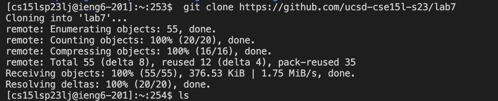
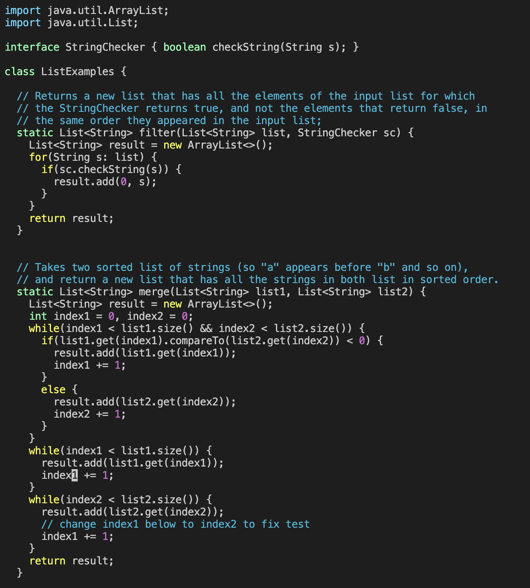
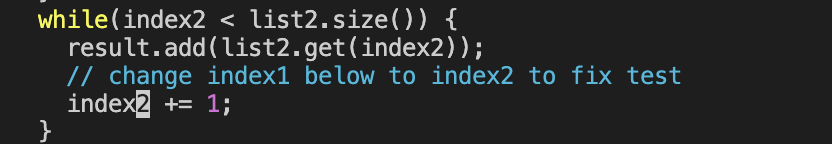
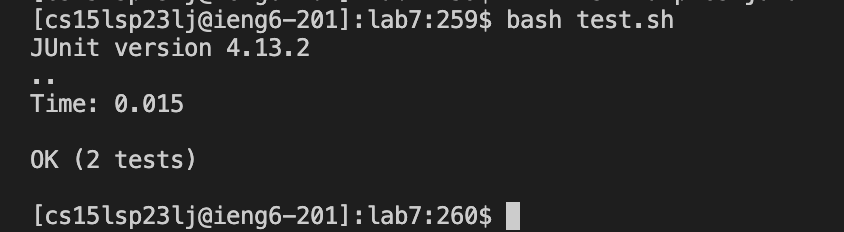
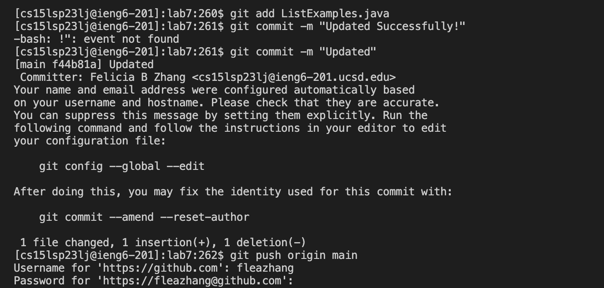

## Lab Report 4 

In this lab report, I will be showcasing the following: 

1. Command line tasks in `vim` 

# Command line tasks in `vim` 

Background information: `vim` is a text editor that allows for programmers or anyone to make edits to their code using command line operations. In this 
example, I will be editing a code file with an error using `vim` commandlines. IMPORTANT: make sure to fork this [repository](https://github.com/ucsd-cse15l-s23/lab7) 
on your github account. 

# 1. Log into ieng6 and cloning a repository 

Firstly, log into your ieng6 account using your account provided from the school. If you don't remember the command here it is :) Remember to swap out
the "xx" with the letters corresponding to your account. The image that follows demonstrates what it should look like after you log in:

type: ssh `<enter>` cs15lsp23xx@ieng6.ucsd.edu `<enter>` (enter your password if you don't have a key.)

`$ ssh cs15lsp23xx@ieng6.ucsd.edu`

After logging in your account successfully, enter in the following command to clone this respository to your account:

type: git `<enter>` clone `<enter>` https://github.com/ucsd-cse15l-s23/lab7 `<enter>` 

`$ git clone https://github.com/ucsd-cse15l-s23/lab7` 

Once you've cloned it into your account, change your directory into the newly cloned repository. 

`$ cd lab7` 

After doing so, use the `ls` command in your terminal to see the current files in your directory. It should look something like this: 

# 2. Editing the code file using vim 

As shown in the image above, the repository contains a code file, a file that contains testers for the code file, a library, and a file to run tests. 
Using that file, type in the following command into your terminal to run the tests and check that they fail. The image following the command is what
the tests should look like if they failed: 

type: bash `<enter>` test.sh `<enter>`

`$ bash test.sh` 

Seeing that it failed, we now enter the code file through vim by typing the following in the terminal:

type: vim `<enter>` ListExamples.java `<enter>` 

`$ vim ListExamples.java` 

After doing so, a file that looks like this should open up:

The error is located in the last while loop of the merge method. The error is that `index1` is used instead of `index2` Starting at the top of the page, hit the 
following keys to edit the vim editor. (NOTE: "type:" indicates the series of keys I hit on my keyboard in the vim editor.

type: /index1 `<enter>` n n n n n n n n n 

I typed /index1 to search for index1 within the code and hit enter to find the first appearance of the word within the code file. (`/` function finds first appearance
of the word within the code). Clicking n allows for you to find the next appearance of the word within the code and clicking n 9 times allows for you to arrive at the 
location of the error. 

type: l l l l l x i 2 `<escape>` 

In the vim editor, you can use the `h` (right), `j` (down) , `k` (up) , `l` (left), keys to move around. Clicking l 5 times allows for my cursor to reach the error (the 1 in index1)
in the term `index1` that I need to fix since it should be `index2`. Clicking x after shifting my cursor onto the the 1 part of `index1` allows for me to delete the 1. To fix the error,
enter the `insert` mode of vim in order to insert a 2 at the end of `index` and hit your escape key to exit. If your code looks like this, you've successfully fixed the error! 

type: :wq `<enter>` 

Typing `:w` allows for you to save your edits and adding a `q` at the end helps you successfully quit out of the terminal. Now check if the tests pass. 

type: `<up>` `<up>` `<enter>` 

Since we used the `bash test.sh` command previously, hitting the arrow key twice allows for us to reach the command since it is in our command history. 
After running the tests successfully, the terminal should show that the tests now pass! 

Yay!! We did it :D 

# 3. Commit and Pushing Changes to the Forked Repository 

After successfully fixing the error and having the tests pass, we need to save our changes. 

type: git add ListExamples.java `<enter>` git commit -m "Updated" `<enter>` git push origin main `<enter>` 

We want to update our github account as well so using the `git add` command allows us to add the file we changed,  `git commit ` allows for us
to commit the changes we made (`-m "Updated"` allows for us to see that it successfully updated) and `git push origin main` allows us to commit the 
final changes to our file. 

Thank you for tuning in to my recent lab report! Hope to see you again soon! :D

