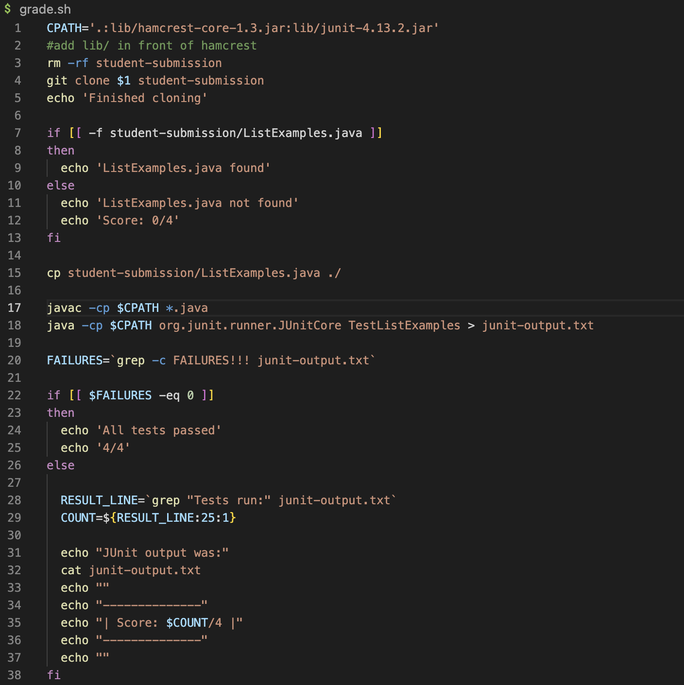

## Lab Report 5 

In this lab report I will be showcasing the following: 

1. Debugging Scenario 
2. Reflection 

# Debugging Scenario 

Hello! Today a TA called in sick so miraculously for some reason I was summoned to fill for their spot. Here's an example of a bugging scenario done 
by a TA (DISCLAIMER: IDK what I'm doing tbh I live the fake it till I make it life). 

Today a student came by with an error and posted it on EdStem. Below is the description of the error they provided. 

Student: 
What environment are you using (computer, operating system, web browser, terminal/editor, and so on)?
- Using Vscode on the Mac Operating System and I'm running commands in the terminal 

Detail the symptom you're seeing. Be specific; include both what you're seeing and what you expected to see instead. Screenshots are great,
copy-pasted terminal output is also great. Avoid saying “it doesn't work”.
- I have a really large error message that pops up on my screen stating that there is an 
 `exception in thread "main" java.lang.NoClassDefFoundError: org/hamcrest/SelfDescribing` and I have no idea what the error could be. Is it perhaps
 my java file? 
 
Detail the failure-inducing input and context. That might mean any or all of the command you're running, a test case, command-line arguments, working
directory, even the last few commands you ran. Do your best to provide as much context as you can.
- This is the command I used that created this error: `bash grade.sh https://github.com/ucsd-cse15l-f22/list-methods-corrected` The code I used was
from this respository provided by the class: [repository](https://github.com/ucsd-cse15l-f22/list-examples-grader/blob/main/grade.sh).

As a TA (not a fake one), I went on to determine how the error may have been caused. As a VERY experienced TA (real) I noticed that 
the error may have something to do with the complier commands within their code because I have failed to compile my code so many times, 
that the error already looked familiar. So after looking at their code, I ran the same command in my terminal as well and sure enough 
the same error was thrown. I followed their code and realized that the error was in their CPATH variable.

TA (me >:)): Could you perhaps try taking a look at your main CPATH line? Try adding to your CPATH variable in line 1 `lib/` in front of 
`hamcrest-core-1.3.jar:lib/junit-4.13.2.jar` and rerun your command line to see if that will resolve the problem. If that does not work, the error 
may indeed be in your java file.

Student: OMG it worked! Can you tell me what the error was and how did you resolve the problem? 

TA (me >:)): Sure thing! The error within your terminal appeared to be a compile error, so I looked at your code and saw you wrote the compiling 
commands within the bash script. I then noticed that you used a CPATH variable within your commands so I then checked your variable to ensure you
had written the path file correctly and noticed you forgot to direct it from the library folder which contains all the junit testing for the files.
Hope that helps! :)

Concise Conclusion of the debugging: 
1. To resolve the problem, I first needed to determine what type of error the student was receiving and what files and commands they possibly used
to cause this error. Both were provided to me by the student which made it a lot more easier for me to debug. 
2. The contents of the file before consisted of the following two images before and after the change as well as the error and fixed results after
the debugging. 

Before: 
code: 

error: 

After: 
code: 

fixed: 

3. The command line used to run the program remained the same: 
command: `bash grade.sh https://github.com/ucsd-cse15l-f22/list-methods-corrected`

4. We edited the CPATH variable within their code in order to fix the error as they forgot to include the `lib` folder within their path. Without it,
the code will not be able to run the tests properly as the files needed to test the code are in that file. 

# Reflection 

Throughout the second half of the quarter, I learned that throughout our labs how to syngergize with others and how to ask for help without feeling
judged as everyone has different learning paces. I also learned how to run bash scripts using the bash command as will as edit code files through 
`vim`. Furthermore, the fourth lab report really helped me learn all the different types of options that the `less` command could have. 

Well unfortunately guys, I was not renewed for another season of these lab reports so this will be the end of my final lab report. Hope everyone has
had a fun time reading my lab reports and maybe I'll catch you on the flip side :) Bye bye! (thank you to the TA's for all your hard work this quarter
we really appreciate you!!)

